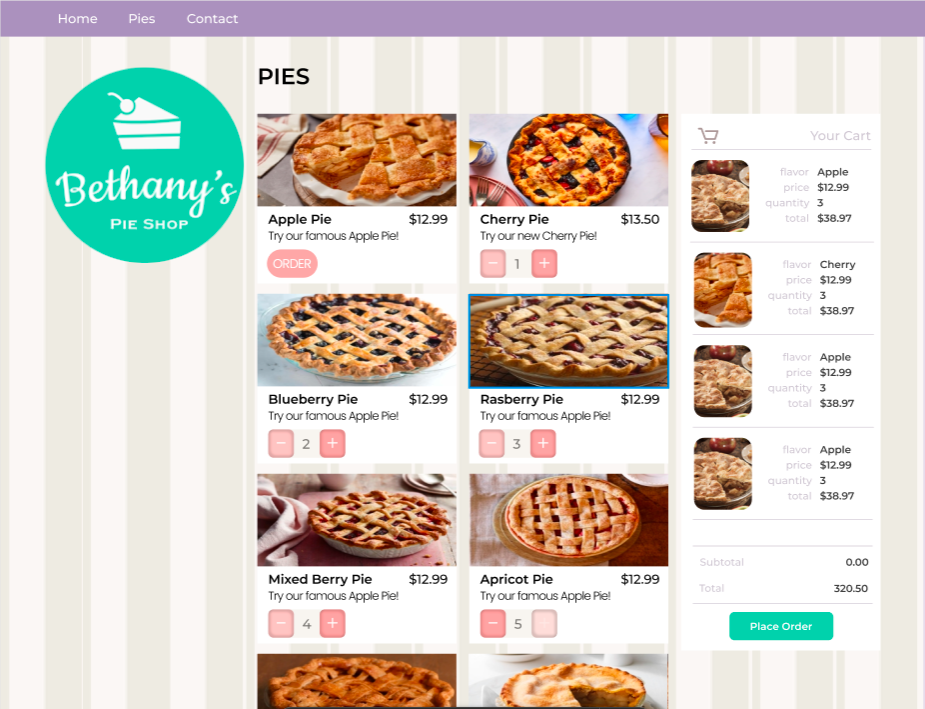

# Pie Shop



[](https://docs.github.com/en/repositories/archiving-a-github-repository/archiving-repositories)
> ⚠ **Note:** This repository has been **archived** and is no longer maintained.
```
This project was implemented in preparation for my internship as a Software Engineering Intern (Java) at Novia East Africa Ltd. back in 2022.
It is no longer in active use, and there are no current or future plans to contribute to or develop this repository further.

The code and history remain available for reference. Feel free to browse or fork, but please be aware that:
- Issues and pull requests are disabled
- No support or updates will be provided

Thanks for your interest!
```

## Introduction
This is a simple full-stack, server side web app to browse through available pies, add orders to cart, fill in checkout forms, and more.

## Technologies
Associated and leveraged in the Project development:
- Java 11
- Spring Boot
- Maven
- PostgreSQL
- IntelliJ IDEA (Ultimate)
- Postman
- Vue.js
- HTML5
- CSS3
- JavaScript (AJAX)
- Figma (you can access the design file [here](https://www.figma.com/design/a9tEWrFGoEIz9wPljUTzzy/Pie-Shop?node-id=0-1&t=RHb2TK5IqdDTe7he-1).)

## Installing/Getting Started
After cloning the project, generate sources and update folders with Maven in your preferred IDE.

This project's backend follows a vertical-slice (package by feature) design structure consisting of 4 packages in the base package: `com.demo.pieshop`

- Cart
- Customer
- Order
- Pie

Find the frontend implementation for this project in the `resources` directory in `src.main`

- static/
- templates/ (Vue.js embedded in HTML)
